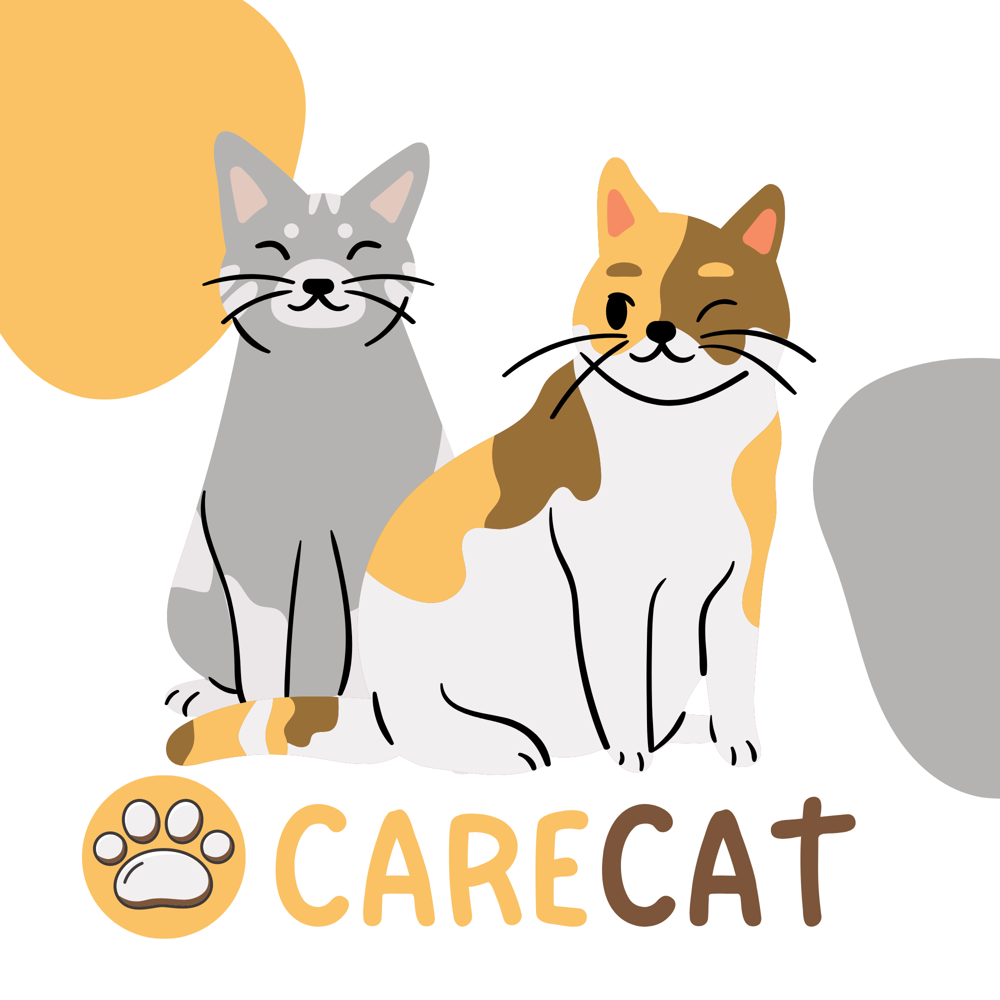
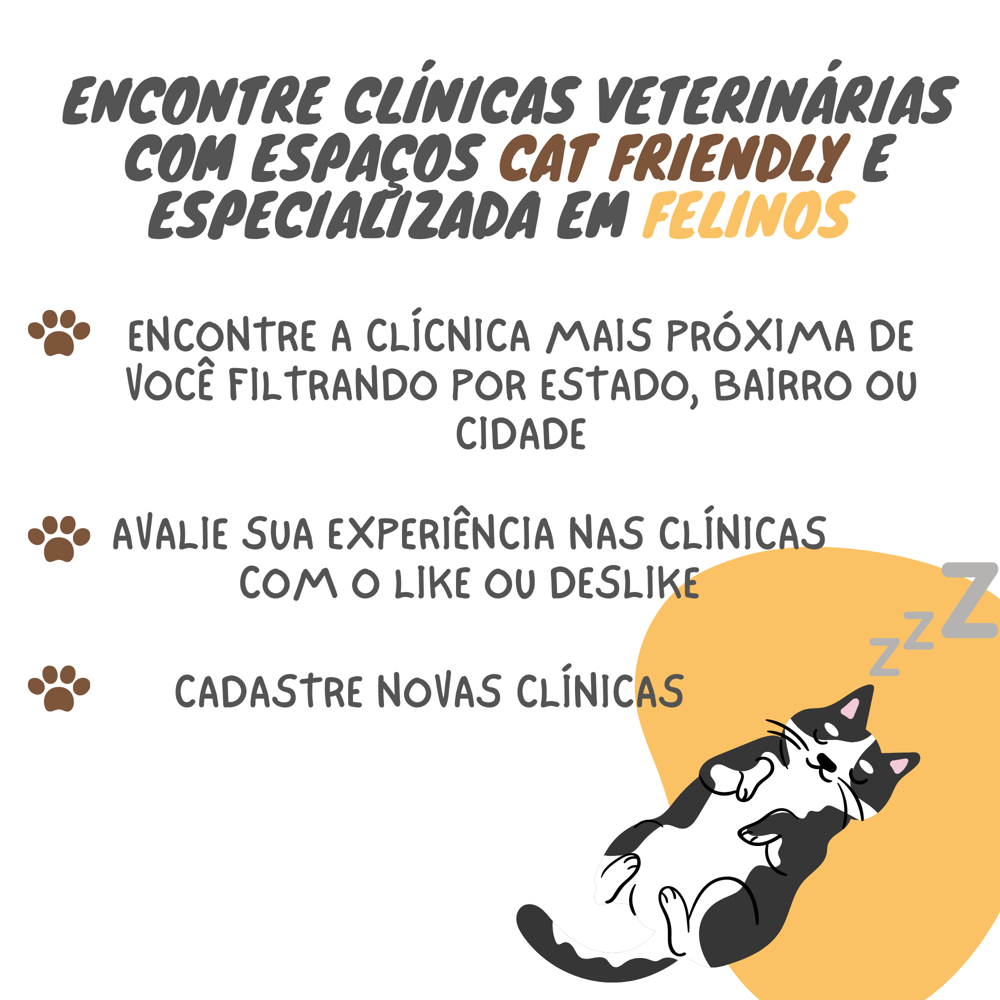

<h1 align="center">
    <br>
    <p align="center">Projeto {Reprograma}<p>
</h1>
<p align="center">


 


# API - CARECAT
## 🚀 Descrição

API desenvolvida nas semanas 10 e 11 do curso de Backend [{Reprograma}](https://reprograma.com.br/).

  A população felina já ultrapassou a caninas em  muitos países e cada vez mais o número de gatos vem crescendo nesses locais. No Brasil não é diferente, a população de gatos tem tido um aumento anual de 8%.
  
  Apesar disso a frequência das visitas de gatos ao veterinário é muito inferior as dos cães. Isso ocorre devido a dificuldade que muitos tutores enfrentam ao levar seus bichanos nas consultas veterinárias, como a dificuldade de transporte até a clínica, o estresse causado nos animais, a forma que o médico veterinário lida com o animal e até mesmo por vergonha do comportamento do felino.

  Visando isso, foram criadas clínicas especializadas em felinos e espaços Cat  Friendly, que possuem como objetivo tornar as idas ao veterinário menos estressante para os gatos, já que o local é preparada especificamente para atender as necessidades felinas.

Como tutora e amante dos gatos sei como uma clínica com espaço Cat Friendely faz diferença no atendimentos dos animais, porém, infelizmente essa prática ainda não é adota por muitas clínicas no Brasil. Com o objetivo de facilitar a pesquisa de locais adequados para levar nossos felinos foi criado o CARECAT. 

O CARECAT é uma plataforma onde os tutores e veterinários podem cadastrar e pesquisar clínicas especializadas em felinos ou que possua espaços Cat Friendely, afinal nossos peludos também precisam de assistência e cuidado, sem estresse e com muito amor e carinho.

# Sumário
=================
<!--ts-->
   * [Objetivos](#objetivos)
   * [Aprendizados](#aprendizados)
   * [Arquitetura Model View Controller](#arquitetura)
   * [Instalação](#instalação)
      * [Pre Requisitos](#pré-requisitos)
      * [Rodando o Back End](#rodando-o-back-end)
      * [Tecnologias](#tecnologias)
      * [Features](#features)
      * [Rotas](#rotas)
   * [Modelo com campos obrigatórios para teste: Postman ou Insomnia](#modelo-com-campos-obrigatórios-para-teste)
  
<!--te-->
  

## ✅Objetivos

- Cadastro de clínicas veterinárias pelos usuarios;
- Busca de estabelecimentos por categoria, por estado, bairro e cidade;
- Avaliação das clinicas atraves de like ou deslike;
- Simplificar a busca de clínicas especializada em felinos ou com espaço Cat Friendly;

## ✅Aprendizados

Criação de uma API fundamentada no CRUD, que são:  CREATE (CRIAR), READ(LER-CONSULTA), UPDATE(ATUALIZAR) e DELETE(DESTRUIÇÃO). 


## ✅Arquitetura

        Arquitetura MVC
        |
        \--📂  CARECAT
            |   README.md  
            |   .env
            |   .gitignore
            |   package-lock.json
            |   package.json
            |   **server.js**
            \--📂 node_modules
            \--📂 assets
            \--📂src
                |
                |   **app.js**
                |
                |
                📂---controller
                |       vetController.js
                |       
                |                      
                📂---model
                |       clinicas.js
                |       
                |
                📂---routes
                |       vetRoutes.js
                
## ✅Instalação
* Para realizar download do projeto, siga as instruções abaixo:

### 👩‍👧‍👦Pré-requisitos

Você precisa ter instalado em sua máquina as seguintes ferramentas:
[Git](https://git-scm.com), [Node.js](https://nodejs.org/en/) e um editor de código como [VSCode](https://code.visualstudio.com/)

### 👩‍👧‍👦Rodando o Back End 

Server Local

```bash
# Com o git
# Clone este repositório
$ git clone <https://github.com/juesantana/On14-TodasEmTech-s11-Revisao-API>

# Acesse a pasta do projeto no terminal/cmd
$ cd CARECAT

# Instale as dependências
$ npm install

# Execute o servidor
$ npm start

# O servidor inciará na porta:7050 - acesse <http://localhost:7050>
```

* Utilize o [Postman](https://www.postman.com/) ou [Insomnia](https://insomnia.rest/download/) para para chamar e testar os endpoints da API localmente 

## 🛠Tecnologias

Para a consturição do projeto, as seguintes tecnologiasforam utilizadas:

- [JavaScript](https://www.javascript.com/)
- [Git/Github](https://github.com/)
- [Node.js](https://nodejs.org/en/)
- [Nodemon](https://nodemon.io/)
- [Express](https://expressjs.com/pt-br/)
- [dotenv](https://www.npmjs.com/package/dotenv)
- [cors](https://www.npmjs.com/package/cors)


Funcionalidades da aplicação

- [x] Cadastros do estabelecimento - POST
- [x] Like ou deslike - POST
- [x] Busca - GET
- [x] Busca por estado, bairro e cidade - GET
- [x] Atualização em todos os campos - PUT
- [x] Apagar - DELETE


#### Retorna teste com apresentação 
{ mensagem: O servidor está rodando em http://localhost:7050 }
- [x] "/clinias" 

#### Cria novo cadastro de estabelecimento
- [x] "/cadastro" 

#### Retorna estabelecimento por um id específico
- [x] "/:Id" 

#### Deleta cadastro do estabelecimento
- [x] "/[ID]/delete" 
 
#### Dar um like em um estabelecimento
- [x] "/[ID]/like" 

#### Dar um deslike em um estabelecimento
- [x] "/[ID]/deslike" 

#### Atualiza o cadastro de um estabelecimento
- [x] "/[ID]/atualizacao"


## ✅Modelo com campos obrigatórios para teste

### 👩‍👧‍👦 Estabelecimentos

{
        "likes": 1,
        "deslike":0,
        "nome": "Cetra Gatos - Clínica Veterinária exclusiva para gatos",
        "estado": "RJ",
        "endereço": "Av. Armando Lombardi",
        "numero":35,
        "bairro":"Barra da Tijuca",
        "cidade":"Rio de Janeiro",
        "telefone":"(21) 3400-2162",
        "especializado": true,
        "catFriendly": true
}


### 🚧 Projeto em Construção

        Autenticação
        Sistema de Login
        Mongo DB
        
## Meus contatos:
- [linkedin](https://www.linkedin.com/in/juliana-santana-53a630b9/)
- [github](https://github.com/juesantana)
- email: juesantana@gmail.com
