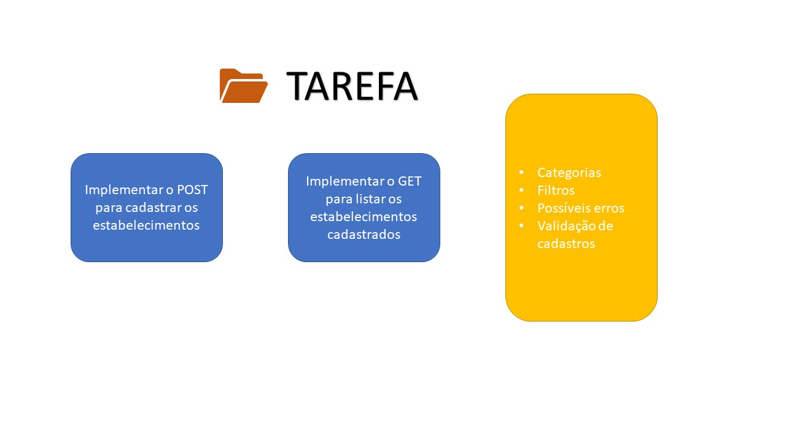

                  # Hello
    
# API - Sugestão de estabelecimentos

## Revisão🚀
Vamos ajudar o nosso comércio local criando uma rede social para os rígidos, vamos separa-los por categorias e bairros.

Foi uma revisão que ajudou a relembrar conceitos e modelos, como:

### Node.js
### HTTP
### API
### REST e RESTful
#### Verbos e métodos

* GET: para consultas
* POST: para criação de informações
* PUT: para atualizações
* PACTH: para alterar

#### Desafios

* Adotar convenção de URLs
* Basear em recursos
* Usar os verbos HTTP para indicar ações
* Ser stateless, ou seja, toda requisição é autossuficiente/independente

### MVC

#### Server.js
> No server chamamos o app para executar a porta e disponibilizar toda a aplicação a partir do localhost

#### App.js
> Noo app foi usado para registrar a rota raiz 

#### 📂Routes
>  Nas rotas usamos os verbos para executar os controllers 

#### 📂Controller
> No controller você vai acessar os dados do model a partir das requisições e enviar respostas

#### 📂Model
> Por enquanto estamos apenas guardando nosso JSON aqui, mas no futuro será o lugar onde iremos modelar os esquemas de dados para o banco.

 -------------------------------             --------------------------

---
## 