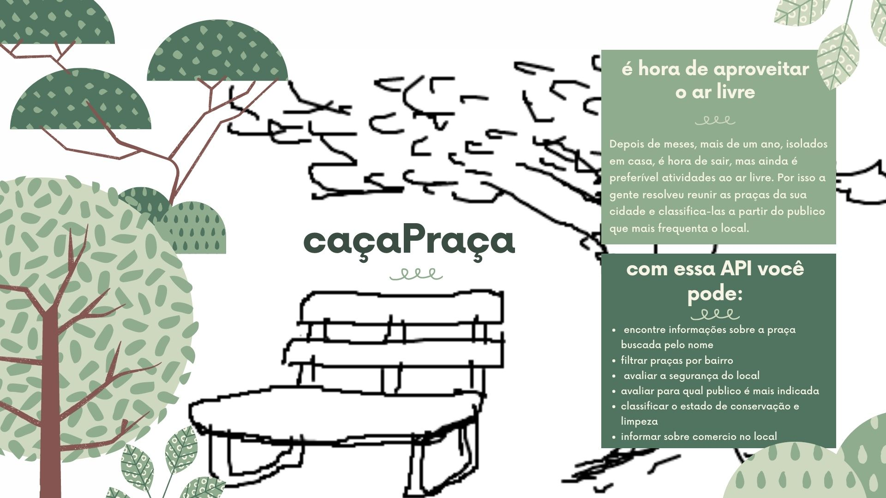
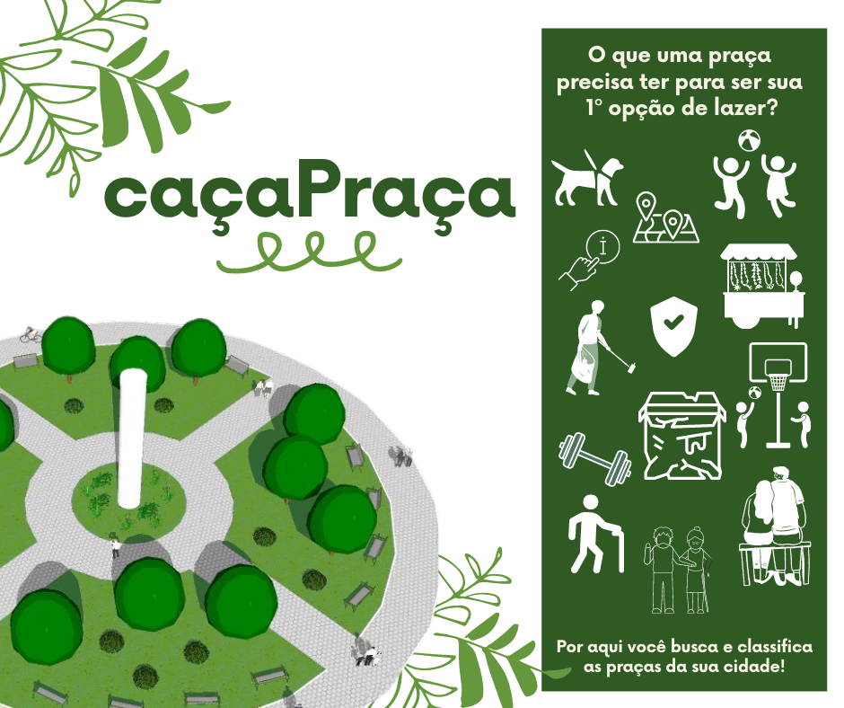

# `API caçaPraça`

##### Disponível em: [GitHub](https://github.com/reprograma/On14-TodasEmTech-s10-Revisao-API/pull/14)

##### Foi desenvolvido por [Darielly Santos](https://www.linkedin.com/in/darielly-santos/)

 

Esse projeto foi desenvolvido para o projeto guiado do [{reprograma}](https://reprograma.com.br/).

O objetivo era desenvolver um serviço de API Rest com crud para listar e classificar estabelecimentos, ou algo de sua escolha, na sua cidade.

  

### Motivação para criação da API

Minha motivação para criar essa API vem da necessidade de ainda termos que ter cuidados ao sairmos de casa, uma das principais solicitações feita pelos especialista é dar preferência a lugares ao ar livre.
As praças sempre foram locais de socialiação, e nesso momento delicado pode ser uma grande aliada na retomada social com segurança.

Com essa API, é possivel verificar varios pontos caracteristicos sobre a praça e localiza-las a partir de um filtro por bairro.

  

### Melhorias na API no futuro

Implementando uma base de dados, será possivel criar uma logica de négocio capaz de classificar as principais caracteristicas da praça conforme seus publicos mais frequênte.

 

 

## Pré requisitos

 

- NodeJs - v10.19.0 - acesse o site oficial para mais informações: https://nodejs.org/en/
- Npm - 6.14.4 - acesse o site oficial para mais informações: https://www.npmjs.com/
- MySql - acesse o site oficial para mais informações: https://www.mysql.com/
- Cors -

 

## Executar projeto

 

Execute o comando abaixo para instalar as dependências do projeto:

`npm install`

Após finalizar as instalações, execute o comando abaixo para iniciar o projeto:

`npm start`

Verifique se a menssagem `port 4000 on, be glad!` aparece no terminal, indicando que o serviço iniciou corretamente.

O endereço de acesso local é: `http://localhost:4000`.

 

## Conhecimentos adquiridos

 

- Estruturar um projeto MVC

- Criar API que subra uma necessidade

- Padrão URL

- Tratamento de erros

- Algumas boas práticas de programação

- Criar um README que valorize o projeto

 
