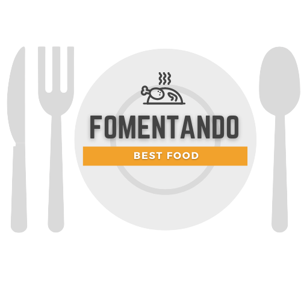

<!--  -->

# 🍽️ Fomentando API 

API desenvolvida em Projeto Guiado, no curso de  Back-end da {Reprograma}. Fomentando é uma plataforma que tem por objetivo classificar os melhores bares e restaurantes da Zona Norte do Recife, tudo de acordo com os próprios moradores da região.


## 📑 Índice
---

   - [Arquitetura](#-arquitetura)
   - [Tecnologias](#-tecnologias)
   - [Orientações](#-orientações)
      - [Pré-requisitos](#-pré-requisitos)
      - [Rodando o Back End (servidor)](#-rodando-o-back-end-servidor)
 

### 🧱 Arquitetura
---
```
├───📂para_o_lar/
    ├───📂assets/
    │   ├───1.png
    │   ├───2.png
    │   └───3.png
    ├───📂src/
    │   ├───📂controllers/
    │   │   └───estabelecimentoControllers.js
    │   ├───📂models/
    │   │   └───estabelecimentos.json
    │   ├───📂routers/
    │   │   └───estabelecimentoRouters.js
    │   └───app.js
    ├───.gitignore
    ├───Instrucoes.md
    ├───package-lock.json
    ├───package.json
    ├───readme.md
    └───server.js
```
### 💻 Tecnologias
---
As seguintes ferramentas foram usadas na construção do projeto:

- [JavaScript](https://www.javascript.com/)
- [Node.js](https://nodejs.org/en/)
- [Express](https://expressjs.com/pt-br/)
- [Nodemon](https://nodemon.io/)
- [Cors](https://www.typescriptlang.org/)

### 📌 Orientações
---
### 📎 Pré-requisitos:
Antes de começar, você vai precisar ter instalado em sua máquina as seguintes ferramentas:
[Git](https://git-scm.com), [Node.js](https://nodejs.org/en/). 
Além disto é bom ter um editor para trabalhar com o código como [VSCode](https://code.visualstudio.com/).

#### 🎲 Rodando o Back End (servidor)

```bash
# Clone este repositório
$ git clone <https://github.com/victoriardspaiva/On14-TodasEmTech-s11-Revisao-API>

# Acesse a pasta do projeto no terminal/cmd
$ cd On14-TodasEmTech-s11-Revisao-API/para_o_lar

# Instale as dependências
$ npm install

# Execute o servidor
$ npm start

# O servidor inciará na porta:7050 - acesse <http://localhost:7050>
```